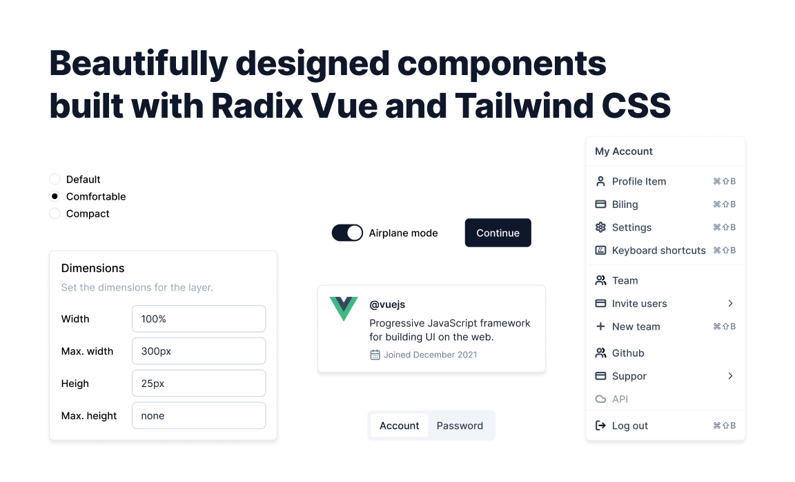

 
 <h1 align="center">
  shadcn-vue
 </h1>

[shadcn-vue](https://www.shadcn-vue.com/) is an unofficial community-led [Vue](https://vuejs.org) port of [shadcn/ui](https://ui.shadcn.com/).

> **Note**   **We are not affiliated with shadcn, but we did get his blessing prior to creating this project**   This is a project born out of the need for a similar project for the vue ecosystem.

Accessible and customizable components that you can copy and paste into your apps. Free. Open Source. **Use this to build your own component library**.

## Documentation

[View documentation here](https://www.shadcn-vue.com/docs/introduction.html)

## Credits

All credits go to these open-source works and resources

- [Shadcn UI](https://ui.shadcn.com) for creating this beautiful project.
- [Shadcn Svelte](https://shadcn-svelte.com) for some inspiration for registry.
- [Radix Vue](https://radix-vue.com) for doing all the hard work to make sure components are accessible.
- [VueUse](https://vueuse.org) for providing many useful utilities.

- [ahmedmayara](https://github.com/ahmedmayara/shadcn-vue) for populating many components

## License

Licensed under the [MIT license](https://github.com/shadcn/ui/blob/main/LICENSE.md).
